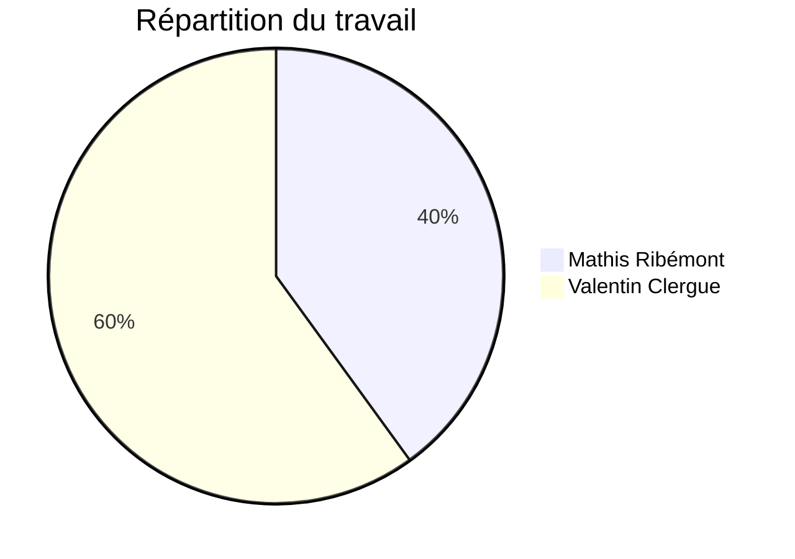

# FishNGrig

## Auteurs

## Descriptif

**FishNGrog** est une application de master detail lambda affichant une liste non exhaustive des poissons du jeu [Sea of Thieves](https://www.seaofthieves.com) affin de connaitres leurs caractéristiques.

La liste des poissons a été obtenu sur [Fandom/wiki](https://seaofthieves.fandom.com/wiki/Fish).

## Usage

Il suffit de lancer l'application sans tout autre configuration.

## Techniques de programmation utilisées

### QtFish

//TODO: MATHIS ALED

Exemple:

*WifiScanner utilise la couche QtNetwork pour avoir scanner le Wifi et récupérer les propriétés réseau*

### QObject avec QProperties

//TODO: MATHIS ALED

Exemple:

*Chaque réseau Wifi est une QTarget, un QObject avec plusieurs propriétés. La modification d'une des propriétés entraîne son rafraîchissement dans les listes.*

### ListView partiellement éditable + Modèle C++ + Tri

//TODO: MATHIS ALED

Exemple:

*La liste des réseau s'appuie sur un modèle C++ qui contient une liste de QTarget. Elle n'est pas éditable mais on peut la reconstruire totalement quand on relance un scan. On peut néanmoins changer le nom d'un réseau (par défaut son SSID), ainsi que la puissance de réception (changée par le scan).*

*La liste est triée par défaut par puissance de réception. Mais le critère de tri peut être modifié dans les options.*

### PullDownMenu

//TODO: MATHIS ALED

Exemple:

*Un PullDownMenu est présent dans la page de la liste des réseaux, il permet de relancer un scan.*

### Clic

Un clic sur un réseau ouvre la page de detail.

## Detail: Modif + QValidator

//TODO: MATHIS ALED

Exemple:

*Le nom du réseau est éditable. Un QValidator permet de s'assuer que le nom choisi ne contient pas d'espaces.*

### Menu Contextuel

//TODO: MATHIS ALED

Exemple:

*Un clic long affiche un menu contextuel permettant d'oublier un réseau.*

### Remorse

//TODO: MATHIS ALED

Exemple:

*L'item précédent utilise une RemorseBar.*

### Options + Sauvegarde (QSettings)

//TODO: MATHIS ALED

Exemple:

*Une page d'options permet de modifier le critère de tri. Nous utilisons QSettings pour le sauvegarder d'une exécution à l'autre.*