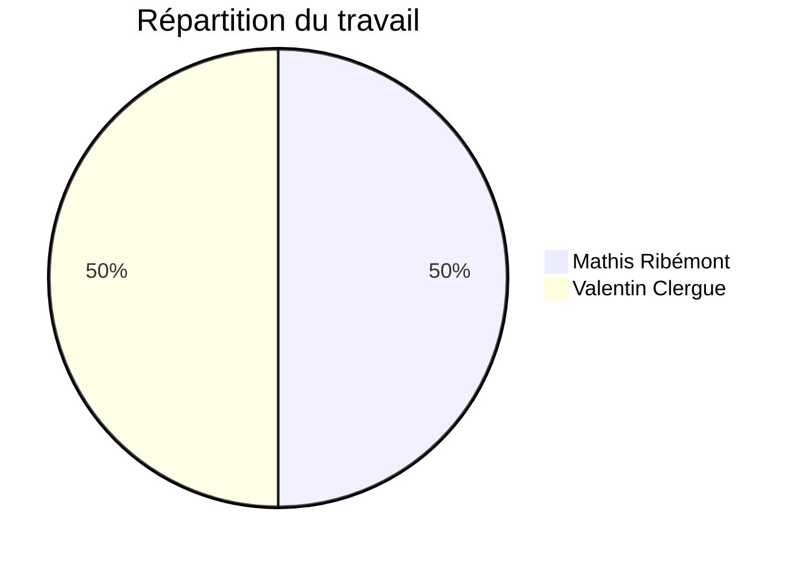

# FishNGrig

## Auteurs



## Descriptif

**FishNGrog** est une application de master detail lambda affichant une liste non exhaustive des poissons du jeu [Sea of Thieves](https://www.seaofthieves.com) affin de connaitres leurs caractéristiques.

La liste des poissons a été obtenu sur [Fandom/wiki](https://seaofthieves.fandom.com/wiki/Fish).

## Usage

Il suffit de lancer l'application sans tout autre configuration.

## Techniques de programmation utilisées

### QtFish

### QObject avec QProperties

QFish est un QObject, est chaque attribut est une QProperty, avec son getter, son setter, et son signal.

### FishModel

Pour l'affichage de la liste, nous avons utilisé un model qui stocke la liste de poisson, pour les afficher dans un délégué.

### Cas des ENUMS

Si on utilise un model pour les fish, comme c'est le cas dans la liste, on pourrait grâce à Qt récupérer le nom de la valeur d'une enum. Le problème c'est que sur la page de détail, nous utilisons les fish directement. Pour résoudre ce problème, nous avons c'est les "propertyS", qui sont les équivalent QString des propriété en enum. C'est à dire que dans le getter, on retourne une QString codée en dur en fonction de la valeur de l'attribut initial.

```cpp
FType m_type;

Q_PROPERTY(FType type           READ type       WRITE setType       NOTIFY typeChanged)
Q_PROPERTY(QString typeS        READ typeS      NOTIFY typeChanged)

FType Fish::type() const {
    return m_type;
}

QString Fish::typeS() const
{
    switch (m_type) {
        case Splashtails:
            return QString("Splashtail");
        break;
        case Pondies:
            return QString("Pondie");
        break;
        ...
        default:
            return QString("Unknown");
        break;
    }
}
```