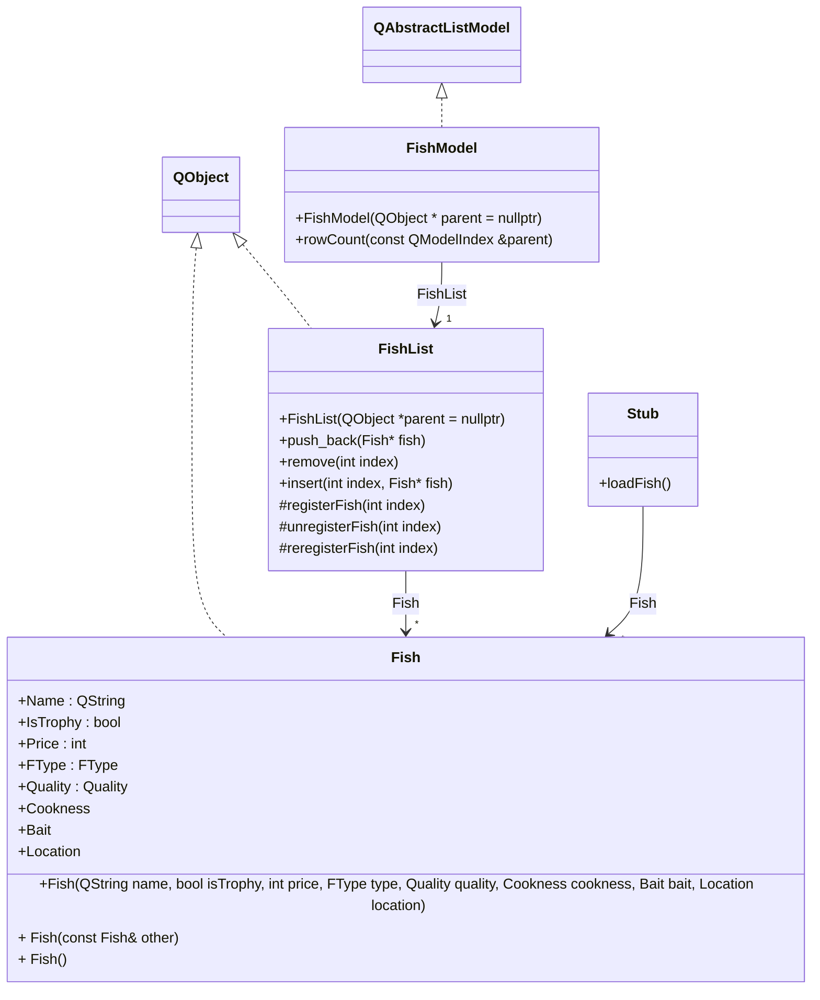

# FishNGrog

## 📝 Purpose

Create a Sailfish app using Qt to experiment this technologie and os. 

- Create a master detail
- Use [**Sailfish**](https://docs.sailfishos.org/Tools/Sailfish_SDK/) features such as pull down menu.

## 🛠 Languages & tools

  

## ⚙️ Getting started

1. Install the [**SailfishSDK**](https://docs.sailfishos.org/Tools/Sailfish_SDK/)
2. Open **Sailfish IDE** (include in the sdk)
3. Open this project and add the requiered SDKs depending on your configurations.
4. Launch the emulator
5. Launch the app
6. You're done ;)

## 📍 Visuals

| Master | Detail |
| --- | --- |
|  |  |

## ⚙️ Architecture

   
## ✍️ Credits 

* Author: [**Mathis Ribemont**](https://github.com/TEDDAC)
* Author: [**Valetin Clergue**](https://github.com/HandyS11)